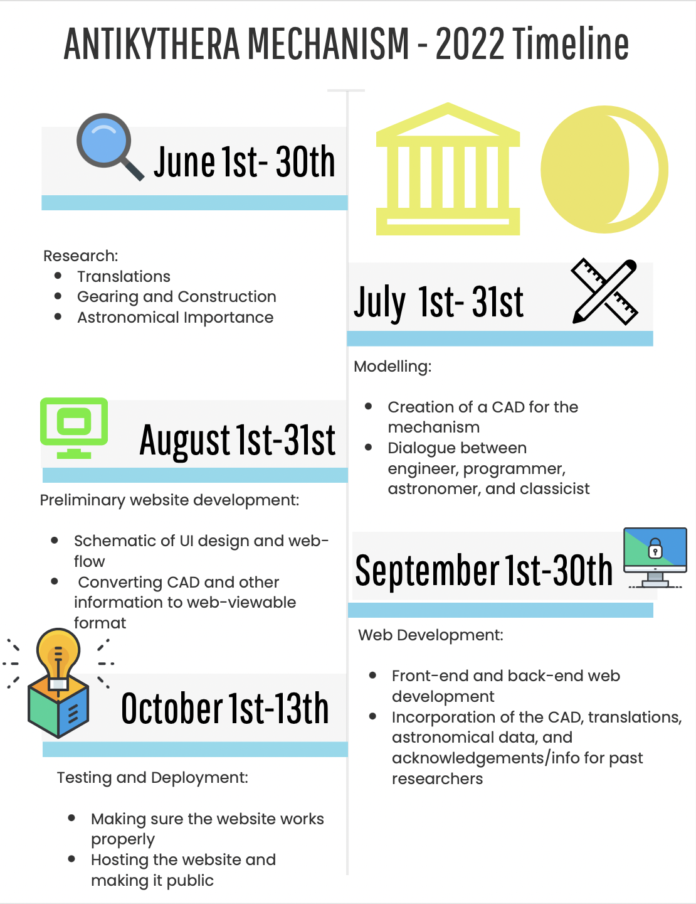

# Methods

&nbsp;&nbsp;&nbsp;&nbsp;&nbsp;&nbsp; Creating an interactive digital model of the Antikythera mechanism would be a truly interdisciplinary project that would necessitate the incorporation of a wide variety of research and development methods from disparate academic fields. Our team will thus consist of four graduate students studying in the fields of astronomy, enigineering, computer science and classical history, respectively.  The preliminary stages of the project's creation would mostly rely on non-digital astronomical, linguistic and engineering research. Initial research would thus come in the form of a reading of the publications written by de Solla, Freeth, and others who have published their findings on the Antikythera mechanism. The team's classicist-in-chief, who must possess a strong knowledge of Ancient Greek, would research the findings of previous researchers as to the mechanism's inscription, and create a working database of all the inscriptions, their positions on the mechanism, and their translations. Such information can be stored in a variety of different places, but will have to be readily for  accessible to the team's other members. In light of this, a collaborative application would be the best place for the classicist to store his translations. Many such collaborative tools exist, such as [Slack](https://slack.com/), [Discord](www.discord.gg), or even the [Google Workspace Suite](https://workspace.google.com/intl/en_ca/) These tools are rather simple, but owing to the fact that the linguistic data will likely only contain three pieces of information (original Greek, English translation and position on the mechanism), simple collaborative tools that do not overcomplicate matters would work best. Additionally, these tools are either free, or quite cheap, thus minimizing cost. The initial schematics for the mechanism, which will also be based off of Freeth's team's findings, will require more complex tools. The mechanism's intricate system of gears and axles would first have to be well-understood by our team's engineer, who will thus need a good deal of experience in mechanical engineering. After the engineer has researched the findings of Freeth's team, he will need to create a 3D model of the mechanism, for which a digital tool will be required. Luckily a variety of cheap or free 3D modelling tools exist, many of which are regularly used by engineering students already, thereby making it likely that our engineer will already possess prior knowledge of the tool they must use. [Tinkercad](https://www.tinkercad.com/) is a free 3D modelling software that is quite common in academic settings. However, Tinkercad's capabilities are limited, and the project may require a more capable, professional software like [Solidworks](https://www.solidworks.com/). After the mechanism's CAD (computer-aided design), has been completed, digital methods and tools will be used to actually create the interactive model which will be available on the web. The methods the team's programmer will use, will not be unlike those taught in the average Digital Humanities class in a typical university. Our programmer will need to have experience with full-stack web development, i.e. both front-end and back-end web development. He will likely work primarily in Javascript, as this seems to be in vogue nowadays. The use of Javascript on both ends of the website ((aside from the website's styling which will use HTML and CSS) will streamline the development process. There are a few free Javascript frameworks that allow developers to incorporate 3D models, one of which is [Three.js](https://github.com/mrdoob/three.js/). Other frameworks used for the website's front end could be Angular.js and [React](https://reactjs.org). These front-end frameworks would be used for displaying dynamic information, such as the English translations of inscriptions, the astronomical importance of the mechanism's various parts, and even background information concerning where and when all of the mechanism's functions were discovered (which could be done through GIS on a separate subpage). The back-end framework used would be [Node.js](https://nodejs.org/en/), and this would handle the webserver and perhaps any potential database information (in tandem with [SQL](https://www.mysql.com)). Finally, after development is finished with the use of these frameworks, the finished model would have to be hosted on the web, through a web application hosting service such as [Heroku](https://www.heroku.com).
# Timeline

Above is a general schematic of the ~5 month timeline for the project, you can find a more detailed description of the project's timeline below:

&nbsp;&nbsp;&nbsp;&nbsp;&nbsp;&nbsp; The project will be created and deployed within an accelerated timeline of roughly 5 months. As you can see, the timeline is divided into three main sections of: research, web development (including preliminary design), and deployment. Although each section will not equally require the involvement of our 4 team members, they will nevertheless all be present throughout the entire timeline, ensuring that there is feedback from all four of their disciplines in each part of the project's construction. The team members will work three times a week in shifts of 4 hours. The intitial research phase will consist of the classicist, engineer and astronomer perusing the findings of Freeth, de Solla, and others. The classicist will work on translating the inscriptions, as briefly mentioned above. Beyond literal translations, the classicist will have to determine the meanings of all the Greek words in their contexts. To quote the second century Rabbi Yehuda, "One who translates literally is a liar, since he distorts the meaning of the text, and conversely, one who adds his own translation is tantamount to one who curses and blasphemes". Our classicist will thus have to tread a fine-line in translating both the original meanings of things such as the Greek months, as well as provide their modern equivalents. In addition to the classicist's translations, our engineer will use this research period to develop an understanding of how the device functions mechanically. He can create his own personal schematics during this period which will be later used. Our astronomer will work with both the classicist and engineer during this time, and he will ascertain from them and the original research what the astronomical purpose of the various inscriptions and mechanical elements are. These three team members will all keep their research findings accessible to each other (and our computer scientist), for later use in the project. After this research phase is completed, the engineer will have to create the CAD that models the mechanism. Luckily, [CADs of the mechanism](https://grabcad.com/library/antikythera-mechanism-4) are already publicly available on the web. These CADs are not perfect because they do not incorporate the most recent research findings, but they will nevertheless ensure that our engineer will not have to start from scratch. During the creation of the CAD, our computer scientist can engage in preliminary work to determine how we will display the model online using the Three.js framework. After the development of the CAD is complete, our computer scientist will begin preliminary web development. He will begin by creating a mockup of the site's UI and webflow, whilst incorporating feedback from his three peers. After this is complete, the actual development of the website will begin. Our programmer will use his team member's findings to create the website. He will need to ensure that the final simulation is interactive, and that it will allow the user to manipulate the mechanism in 3D space, as well as actually turn the handcrank so as to engage the mechanism. After the website is finished, the team will test the website, and carefully analyze it for any mistakes (content, mechanical, or otherwise). After this testing is finished, the website will be deployed through Heroku, and will then be available for public enjoyment. 

# Importance

&nbsp;&nbsp;&nbsp;&nbsp;&nbsp;&nbsp; The project's entire purpose is inextricably linked to its importance as an educational tool. The educational value of an interactive model of the mechanism, spans across a few different academic fields. Astronomically, the mechanism demonstrates how the Ancient Greeks could track the motions of the sun, moon and planets. This was done without an understanding of the laws of planetary motion, and the mechanism was developed prior to the heliocentric model of our solar system. The mechanism is thus educationally valuable because it demonstrates how much its Ancient Greek builders knew, whilst also showing us how many things they didn't know. The mechanism carries pedagogical value in the field of mathematics, as it was purely through mathematical means that the Ancient Greeks could accurately track the motion of planets without an understanding of the elliptical nature of their orbits. The mechanism showcases how important the sky has always been through the course of human history. An understanding of space helped ground humanity temporally, and has also helped us navigate and grow food. It is because of this that so many well-known megalithic structure emphazised certain astronomical phenomona (Stonehenge, the Pyramid of the Sun, etc.). The Antikythera Mechanism allowed its users to understand these phenomana through portable means. In the modern day, we can all pull out a star chart on our mobile phones, and one could imagine that this was the ancient Greek equivalent of doing that, in lieu of a Steve Wozniak, Larry Page or Sergey Brin to help them out. A digital model of the mechanism could inform a wider audience of all of these facts. Moreover, the mechanism itself is incredibly important because it challenges certain assumptions held about antiquity. It is the only such model to have been found, which raises important questions about what fascinating discoveries in the vein of the mechanism remain to be found. Archaeology and history are fields that engage in an incessant broken telephone game with humanity's past. However, as our research methods improve, the 'cellular signal', so to speak, between us and our past, grows stronger. We would never claim that our model will present an unadulterated replica of what the ancient mechanism would have looked like or done, but it will represent the best approximation yet. In keeping with the cellular metaphor, we hope to offer perhaps a 3G, or maybe even LTE-esque view of this stunning ancient device. In doing so, we hope to inspire a sense of erudition and fascination among all those who interact with our model. Whether this inspired curiosity will ultimately be aimed towards classical history, mathematics, astronomy or computer science, it doesn't really matter, as the world will always need curious people who can think critically about the world around them, and who will never stop asking questions.

# Bibliography

Derek de Solla Price - "Gears from the Greeks. The Antikythera Mechanism: A Calendar Computer from ca. 80 B. C." (<https://www.jstor.org/stable/1006146?Search=yes&resultItemClick=true&searchText=antikythera+mechanism&searchUri=%2Faction%2FdoBasicSearch%3FQuery%3Dantikythera%2Bmechanism%26so%3Drel&ab_segments=0%2FSYC-6168%2Ftest&refreqid=fastly-default%3Aaf25da3fc13cf807908ab90c22e38213&seq=5#metadata_info_tab_contents">)

Jarrett A. Lobell - "The Antikythera Mechanism" (<https://www.jstor.org/stable/41780223?Search=yes&resultItemClick=true&searchText=antikythera+mechanism&searchUri=%2Faction%2FdoBasicSearch%3FQuery%3Dantikythera%2Bmechanism%26so%3Drel&ab_segments=0%2FSYC-6168%2Ftest&refreqid=fastly-default%3Af62f4659066b86e8882256c69794fd91&seq=3#metadata_info_tab_contents>)

Tony Freeth - "A Model of the Cosmos in the ancient Greek Antikythera Mechanism" (<https://www.nature.com/articles/s41598-021-84310-w>)

Tony Freeth - "Calendars with Olympiad and Eclipse Prediction on the Antikythera Mechanism" (<https://web.archive.org/web/20130927141324/http://www.antikythera-mechanism.gr/system/files/Antikythera_Nature2008_submitted.pdf>)

Ioannis Diolatzis - "3D virtual model of the Antikythera mechanism" (<https://www.youtube.com/watch?v=hFJqjCEFco4>)

# Budget
| Item                               | Category     | Cost       | Percentage | Notes                                                                                                            |
| ---------------------------------- | ------------ | ---------- | ---------- | ---------------------------------------------------------------------------------------------------------------- |
| Salary - Engineer (Grad Student)   | Labour       | $3,264.00  | 21.77%     | 3 days a week \* 4 hours a day \* 15 dollars an hour \* 4 weeks a month \* 16 weeks for project                  |
| Salary - Astronomer (Grad Student) | Labour       | $3,264.00  | 21.77%     |                                                                                                                  |
| Salary - Programmer (Grad Student) | Labour       | $3,264.00  | 21.77%     |                                                                                                                  |
| Salary - Classicist (Grad Student) | Labour       | $3,264.00  | 21.77%     |                                                                                                                  |
| Heroku Web Hosting                 | Subscription | $250.00    | 1.67%      | Performance Tier (Because of the intensive nature of the Graphics) (This is a yearly fee)                        |
| Solidworks Student License         | License      | $150.00    | 1.00%      | Student License (The Professional License is $2000!!)                                                            |
| Slack Pro                          | Subscription | $36.00     | 0.24%      | $8 a month for 4 months. Getting Pro because you can store larger amounts of data in the colloborative workspace |
| Electronic Equipment               | Equipment    | $1,000.00  | 6.67%      | Computer, monitors, mouse, development peripherals                                                               |
| Engineering Equipment              | Equipment    | $500.00    | 3.34%      | Tools and materials (perhaps he will make a physical mockup). Sketching tools, pencils/pens, blueprint material  |
|                                    |              |            |            |
|                                    | Total:       | $14,992.00 |